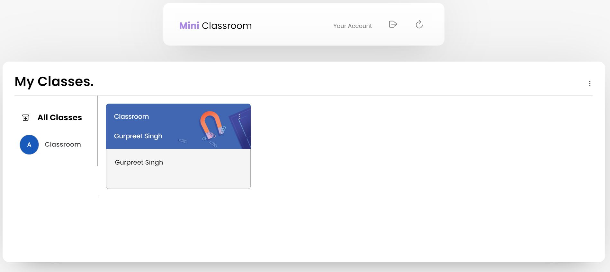
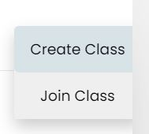
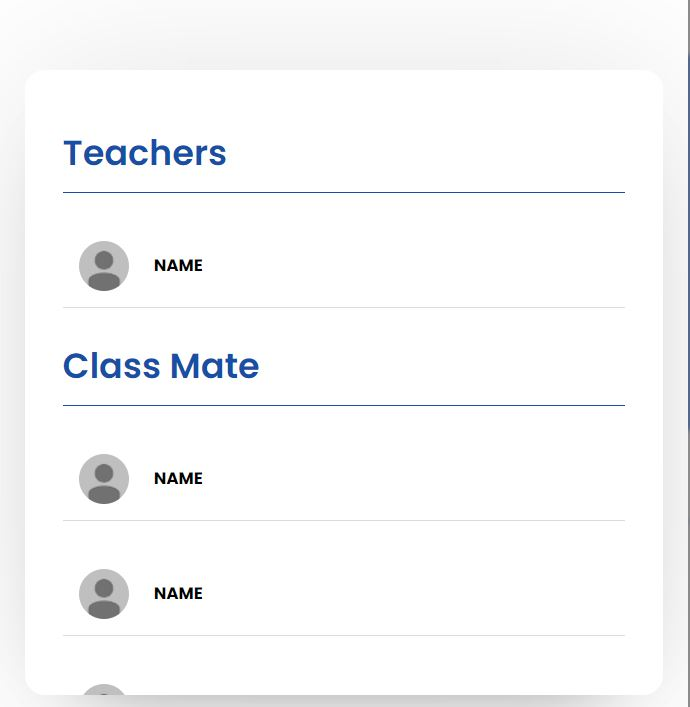
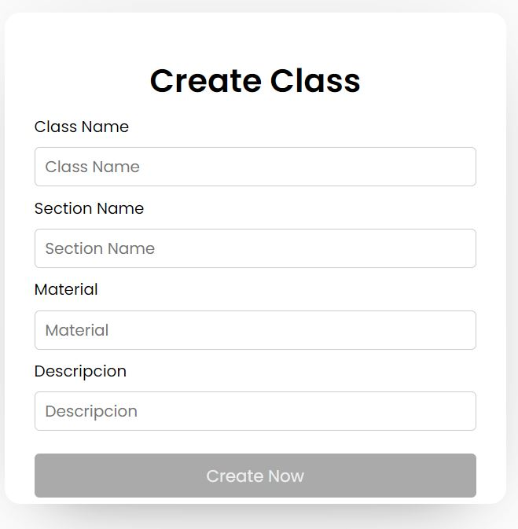
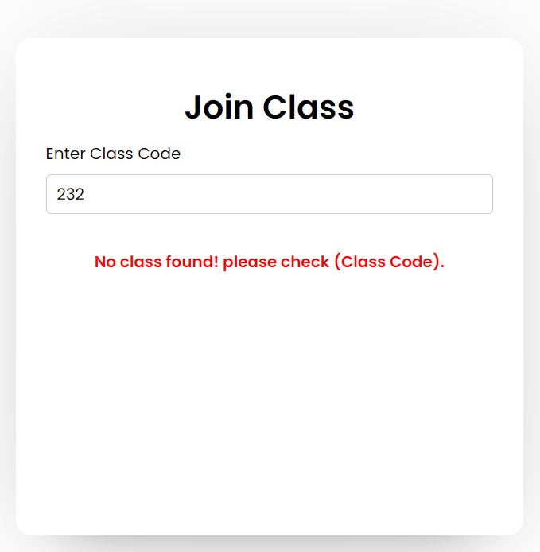

## Mini Classroom

### Install node dependencies

```

npm install

```

### Start server

```

npm start

```

### Run supervised server

Watch server for changes and restarts it if necessary

```

npm run supervisor
```

## Captures

Home Page



Options To add Classes



Class Interface Page


Class Persons List




Create Class Template



Join Class Template


