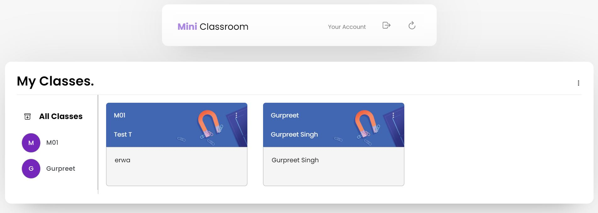

## Mini Classroom
Mini Classroom is a web application that allows us to create different types of classes like Google Classroom, where students can join classes, also they can create tasks and reply to them. This web app is built with HTML, CSS, JavaScript, NodeJs and for database, I used MySQL.

### Install node dependencies

```

npm install

```

### Start server

```

npm start

```

### Run supervised server

Watch server for changes and restarts it if necessary

```

npm run supervisor
```

## Captures

Home Page



Options To add Classes


Class Interface Page


Assignment Page


Class Persons List


Create Class Template


Join Class Template


